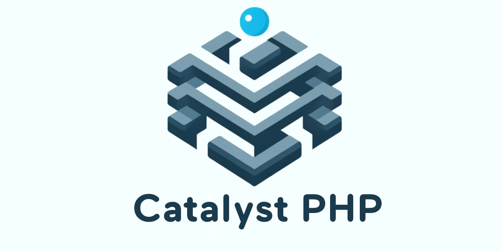

# About CatalystPHP

CatalystPHP: A type-safe, dependency-free PHP framework designed for developers who prioritize precision and efficiency in their web applications.

- **Type-Safe**: Enhanced reliability with strict type enforcement.
- **Dependency-Free**: Standalone architecture, free from external library dependencies.
- **Built-in Template Engine**: Integrated template engine for seamless UI development.
- **Performance-Oriented**: Designed for optimal performance in web application development.
- **Comprehensive Validation Rules**: Includes a set of built-in validation rules, allowing for easy and effective data validation.

## Framework Overview


## Table of Contents

- [About CatalystPHP](#about-catalystphp)
  - [Framework Overview](#framework-overview)
  - [Table of Contents](#table-of-contents)
  - [Requirements](#requirements)
  - [Installation](#installation)
  - [Project structure](#project-structure)
  - [Routing](#routing)
    - [Overview](#overview)
    - [Defining Routes](#defining-routes)
    - [Available Route Methods](#available-route-methods)
    - [Note on Using the DELETE Method in Forms](#note-on-using-the-delete-method-in-forms)
  - [Route Parameters](#route-parameters)
  - [Middleware Association](#middleware-association)
  - [Middleware](#middleware)
    - [Overview](#overview-1)
    - [Registering Global Middleware](#registering-global-middleware)
    - [Creating Custom Middleware](#creating-custom-middleware)
  - [Creating and Using Services](#creating-and-using-services)
    - [Creating Services](#creating-services)
    - [Using Database Queries in Services](#using-database-queries-in-services)
    - [Available Database Query Methods](#available-database-query-methods)
  - [Framework Validation Rules](#framework-validation-rules)
    - [Available Rules](#available-rules)
    - [Usage](#usage)
  - [Extending the Validator](#extending-the-validator)
    - [Creating a Custom Validation Rule](#creating-a-custom-validation-rule)
  - [Integrating Custom Rule into Validator](#integrating-custom-rule-into-validator)
  - [Template Engine](#template-engine)
    - [Rendering Views](#rendering-views)
    - [Handling CSRF Tokens](#handling-csrf-tokens)
    - [Managing Old Form Data](#managing-old-form-data)
    - [Displaying Validation Errors](#displaying-validation-errors)
    - [Handling Sensitive Form Data](#handling-sensitive-form-data)
  - [Custom Helper Functions](#custom-helper-functions)

## Requirements

Ensure your development environment meets these requirements.

- **PHP**: Version 8.1 or newer.
- **Web Server**: Compatible with standard web servers like Apache or Nginx.
- **Database**: SQL database system for database (optional).


## Installation

To get started with the framework, follow these simple steps:

1. **Clone the Repository**: Clone the framework repository to your local machine or download the source code.
   
    ```
    git clone https://github.com/Syndrom7/CatalystPHP.git
    ```
2. **Set Up Your Environment**: Ensure your environment meets the [requirements](#requirements).
3. **Configure Your `.env` File**: Copy the `.env.example` file and rename the copy to `.env`.
4. **Configure Your Application**: Set up your application configurations, database connections, and other necessary settings.
5. **Run Your Application**: Start your web server and access your application.


## Project structure

```
CatalystPHP/
    public/                                 # Accessible files. What final users see
        assets/
            main.css                        # Compiled css file                 
        .htaccess                           # Redirect everything to public/ folder
        index.php                           # Starting point for the entire app
    src/
        App/
            Config/                         # Configuration classes and settings
                Middleware.php              # Global Middleware configuration settings
                Paths.php                   # Path constants used frequently
                TemplateConfig.php          # Template engine configuration settings
            Controller/                     # Controller classes handling the business logic
            Database/
                database.sql                # SQL database file with schema
            Middleware/                     # Middleware classes for request handling
            Routes/
                web.php                     # Web routes definitions
            Services/                       # Service classes for business logic
            views/                          # View templates for the application
                partials/                   # Reusable view fragments
                index.php                   # Main entry view template
            bootstrap.php                   # Initial setup script for the application
            container-definitions.php       # Dependency injection container definitions
            functions.php                   # Custom global functions for the app
        Framework/
            Contracts/
                MiddlewareInterface.php     # Interface for middleware classes
                RuleInterface.php           # Interface for validation rules
            Exceptions/
                ContainerException.php      # Custom exception for container errors
                CsrfException.php           # Custom exception for csrf errors
                SessionException.php        # Custom exception for session errors
                ValidationException.php     # Custom exception for validation errors
            Rules/                          # Validation rule classes
            Utilities/
                AutoLoader.php              # AutoLoader for class loading
                DotenvLoader.php            # Loader for environment variables
            App.php                         # Core application class
            Container.php                   # Dependency injection container
            Database.php                    # Database connection and handling
            Router.php                      # Routing mechanism for the application
            TemplateEngine.php              # Template rendering engine
            Validator.php                   # Input validation handling
    storage/
        uploads/
            .gitkeep                        # Git file to keep the uploads directory
    .env.example                            # Example environment variables file
    .gitattributes                          # Git attributes configuration
    .gitignore                              # Files/folders to be ignored by version control
    README.md                               # Project information and documentation
```

## Routing

### Overview

The routing system in the framework is responsible for directing HTTP requests to their corresponding controller actions. It allows defining routes with different HTTP methods and associating middleware with specific routes.

### Defining Routes

Basic Routes
Routes are defined in the Routes directory, in a file named web.php. A route is associated with a URI, an HTTP method, a controller action and optionally a middleware

```php
use App\Controllers\{HomeController, AuthController};

// Define routes
$app->get("/", [HomeController::class, "home"]);
$app->get("/register", [AuthController::class, "registerView"])->middleware(AuthRequiredMiddleware::class);
//...other routes
```

### Available Route Methods

| Method Name   | Description                                                                  | Example Usage                                           |
|---------------|------------------------------------------------------------------------------|---------------------------------------------------------|
| GET           | Used for retrieving resources. Typically used to display a page or data.     | `$app->get('/path', [Controller::class, 'method']);`    |
| POST          | Used for creating resources. Commonly used for form submissions.             | `$app->post('/path', [Controller::class, 'method']);`   |
| DELETE        | Used for deleting resources. Commonly used for removing data.                        | `$app->delete('/path', [Controller::class, 'method']);` |

### Note on Using the DELETE Method in Forms

In HTML forms, the DELETE method is not natively supported. To work around this limitation, a hidden input field can be used for DELETE request. Here's how you can implement it:

```html
<form action="/route" method="post">
    <input type="hidden" name="_METHOD" value="DELETE" />
    <!-- Other form fields -->
    <button type="submit">Delete</button>
</form>
```

## Route Parameters

Routes can have parameters, which are passed to the controller methods:

```php
$app->get("/user/{id}", [UserController::class, "show"]);
```

## Middleware Association

Middleware can be associated with routes to perform actions before the request is handled by the controller:

```php
use App\Middleware\AuthRequiredMiddleware;

$app->get("/profile", [UserController::class, "profile"])->middleware(AuthRequiredMiddleware::class);
```

## Middleware

### Overview

Middleware in this framework are used to perform actions before or after a request is processed by the controller. This is useful for tasks like authentication, logging, input validation, and more.

### Registering Global Middleware

Global middleware are executed for every request to the application, regardless of the route.

**How to Register Global Middleware:**
To register global middleware, define them in the Config directory, in a file named `Middleware.php`. Use the `registerMiddleware` function to add them to the application.

```php
namespace App\Config;

use Framework\App;
use App\Middleware\{SessionMiddleware, CsrfGuardMiddleware, ...};

function registerMiddleware(App $app) {
    $app->addMiddleware(SessionMiddleware::class);
    $app->addMiddleware(CsrfGuardMiddleware::class);
    // ... add other middleware
}
```

### Creating Custom Middleware

To create custom middleware, follow these steps:

1. **Implement the MiddlewareInterface**: Create a new class that implements `MiddlewareInterface`. This interface requires you to define a `process` method.
2. **Define the Process Method**: The `process` method should contain the logic that you want to execute. If the request should continue to the next middleware or controller, call `$next()`.

Example of Custom Middleware

```php
namespace App\Middleware;

use Framework\Contracts\MiddlewareInterface;

class CustomMiddleware implements MiddlewareInterface {
    public function process(callable $next) {
        // Your custom logic here

        // Proceed to the next middleware
        $next();
    }
}

```

3. **Register the Middleware**: After creating your custom middleware, don't forget to register it using the registerMiddleware function in your application's middleware configuration.

## Creating and Using Services

### Creating Services

Services in the framework are classes that encapsulate logic and data access. They can interact with the database, perform complex calculations, or handle rules.

Steps to Create a Service:

1. **Define the Service Class**: Create a new class in the App\Services directory. This class should encapsulate specific functionality of your application.
   
```php
namespace App\Services;

use Framework\Database;

class UserService {
    private Database $db;

    public function __construct(Database $db) {
        $this->db = $db;
    }

    // Service methods here
}

```

2. **Implement Logic**: Add methods to your service class that contain the logic.

```php
public function findUserByEmail($email) {
    return $this->db->query("SELECT * FROM users WHERE email = :email", ['email' => $email])->find();
}
```

3. **Inject Dependencies**: If your service depends on other classes, such as Database, use dependency injection to provide these dependencies.

4. **Registering Services in the Container Definitions**: In your container definitions file, register services by associating service class names with factory callbacks that describe how to instantiate these services. Here is an example of how to register a new service:
   
```php
use Framework\{TemplateEngine, Database, Container};
use App\Config\Paths;
use App\Services\{ValidatorService, UserService, NewService}; // Include your new service

return [
    // Other services...

    // Example: New service instance with dependencies
    NewService::class => function (Container $container) {
        // Resolve dependencies
        $dependency = $container->get(DependencyClass::class);

        // Return the instantiated service
        return new NewService($dependency);
    }
];
```

In this example, NewService is registered with a factory callback that fetches its required dependencies from the container before instantiating the service.

### Using Database Queries in Services

To use database queries in a service, you can utilize the `Database` class provided by your framework. This class offers methods to prepare and execute SQL queries, retrieve results, and handle errors.

Example of a Database Query in a Service:

```php
public function getAllUsers() {
    return $this->db->query("SELECT * FROM users")->findAll();
}
```

### Available Database Query Methods

| Method Name   | Description                                     | Example Usage                       |
|---------------|-------------------------------------------------|-------------------------------------|
| `query`         | Prepares and executes a SQL query.              | `$db->query("SELECT * FROM table")` |
| `find`          | Retrieves a single row from the result set.     | `->find()`                          |
| `findAll`       | Retrieves all rows from the result set.         | `->findAll()`                       |
| `count`         | Retrieves the count of rows.                    | `->count()`                         |
| `lastInsertId`  | Retrieves the last inserted ID in the database. | `$db->lastInsertId()`               |


## Framework Validation Rules

This table provides an overview of the available validation rules in the Framework. These rules can be used to validate various fields in your forms.

### Available Rules

| Rule Name         | Description                                          | Example Usage                |
|-------------------|------------------------------------------------------|------------------------------|
| RequiredRule      | Validates that a field is present and not empty.     | `"field" => ["required"]`      |
| EmailRule         | Checks if a field contains a valid email address.    | `"email" => ["email"]`        |
| MinRule           | Validates the minimum length of a field's value.     | `"age" => ["min:18"]`          |
| MaxRule           | Validates the maximum length of a field's value.     | `"description" => ["max:255"]`|
| NumericRule       | Ensures a field's value is numeric.                  | `"amount" => ["numeric"]`      |
| UrlRule           | Checks if a field contains a valid URL.              | `"website" => ["url"]`        |
| MatchRule         | Validates if one field matches another field.        | `"confirmPassword" => ["match:password"]` |
| InRule            | Ensures a field's value is within a set of values.   | `"country" => ["in:USA,Canada,Mexico"]`   |
| DateFormatRule    | Validates a date against a specific format.          | `"date" => ["dateFormat:Y-m-d"]` |
| AlphaNumericRule  | Checks if a field contains only alphanumeric chars.  | `"username" => ["alphaNumeric"]` |
| LengthRule        | Validates the length of a field's value is within a specific range. | `"username" => ["length:4,12"]` |
| RegexRule         | Validates a field against a regular expression.      | `"postcode" => ["regex:/^[A-Z0-9]+$/i"]`  |

### Usage

Here is an example of how to use these validation rules in a service:

```php
use Framework\Validator;
use Framework\Rules\{EmailRule, RequiredRule};

class ValidatorService {
    private Validator $validator;

    public function __construct() {
        $this->validator = new Validator();
        // Add rules
        $this->validator->add("required", new RequiredRule());
        // ... other rules
    }

    public function validateSomeData(array $formData) {
        $this->validator->validate($formData, [
            "email" => ["required", "email"],
            // ... other field validations
        ]);
    }
}
```

## Extending the Validator

This allows you to add custom validation rules to suit your specific requirements. This section explains how to create and integrate custom rules into the Validator.

### Creating a Custom Validation Rule

To create a custom validation rule:

1. **Implement the `RuleInterface`**: Your custom rule should implement the `RuleInterface`. This requires defining two methods: `validate` and `getMessage`. The `validate` method contains the logic of your validation, and `getMessage` should return an error message when validation fails.

    ```php
    namespace Framework\Rules;

    use Framework\Contracts\RuleInterface;

    class CustomRule implements RuleInterface {
        public function validate(array $data, string $field, array $params): bool {
            // Add your validation logic here
        }

        public function getMessage(array $data, string $field, array $params): string {
            return "Error message for validation failure";
        }
    }
    ```

2. **Validation Logic**: In the `validate` method, add the logic for your validation. The method should return `true` if the validation passes and `false` otherwise.

3. **Error Message**: The `getMessage` method should return a string that describes why the validation failed. This message is used to inform the user about the validation error.

## Integrating Custom Rule into Validator

Once you have created your custom rule, you can integrate it into the Validator as follows:

1. **Instantiate Your Custom Rule**: Create an instance of your custom validation rule.

    ```php
    $customRule = new CustomRule();
    ```

2. **Add the Rule to the Validator**: Add your custom rule to the Validator using the `add` method. You need to specify a unique name for your rule, which will be used when defining validation logic for fields.

    ```php
    $validator = new Validator();
    $validator->add('customRule', $customRule);
    ```

3. **Use the Custom Rule in Validation Definitions**: Now, you can use your custom rule in the same way as predefined rules.

    ```php
    $validator->validate($formData, [
        "customField" => ["customRule"],
        // ... other field validations
    ]);
    ```


## Template Engine

The `TemplateEngine` facilitates rendering views, handling CSRF tokens, managing old form data, and displaying validation errors. This section will walk you through the basic usage of these features.

### Rendering Views

You can render views using the `render` method of the `TemplateEngine`. Here's an example:

```php
namespace App\Controllers;

use Framework\TemplateEngine;

class ViewController {
    private TemplateEngine $view;

    public function __construct(TemplateEngine $view) {
        $this->view = $view;
    }

    public function showView() {
        echo $this->view->render('viewName');
    }
}
```
In this example, showView method renders a view called 'viewName'.

### Handling CSRF Tokens

To include CSRF tokens in your forms, you can use the csrfField method of the TemplateEngine:
```php
<form method="post" action="/route">
    <?php echo $this->csrfField(); ?>
    <!-- Other form fields -->
</form>
```


### Managing Old Form Data

To retain previously submitted form data, use the oldInput method:

```php
<input type="text" name="fieldname" value="<?php echo htmlspecialchars($this->oldInput($oldFormData, 'fieldname')); ?>">
```

### Displaying Validation Errors

For showing validation errors, utilize the getErrorMessages method:

```php
<?php foreach ($this->getErrorMessages('username', $errors) as $error) : ?>
    <?php echo htmlspecialchars($error); ?>
<?php endforeach; ?>
```

### Handling Sensitive Form Data

In the `ValidationExceptionMiddleware`, sensitive fields such as `"password"` and `"confirmPassword"` are excluded from session storage to enhance security:

```php
namespace App\Middleware;

class ValidationExceptionMiddleware {
    // ...
    public function process(callable $next) {
        try {
            $next();
        } catch (ValidationException $exception) {
            $oldFormData = $_POST;
            // Add fields to exclude as per requirement
            $excludedFields = ["password", "confirmPassword"] ;
            $formattedFormData = array_diff_key($oldFormData, array_flip($excludedFields));

            // Store the formatted data, excluding sensitive fields
            $_SESSION["oldFormData"] = $formattedFormData;
            // ...
        }
    }
}

```

## Custom Helper Functions

The framework includes several custom helper functions to simplify common tasks and improve the development experience. Below is a table of available functions along with their descriptions and example usages.

| Function Name  | Description                                                         | Example Usage          |
|----------------|---------------------------------------------------------------------|------------------------|
| dd             | Dumps the given variable(s) for debugging and terminates execution. | `dd($variable);`       |
| redirectTo     | Performs an HTTP redirect to the specified path.                    | `redirectTo('/home');` |